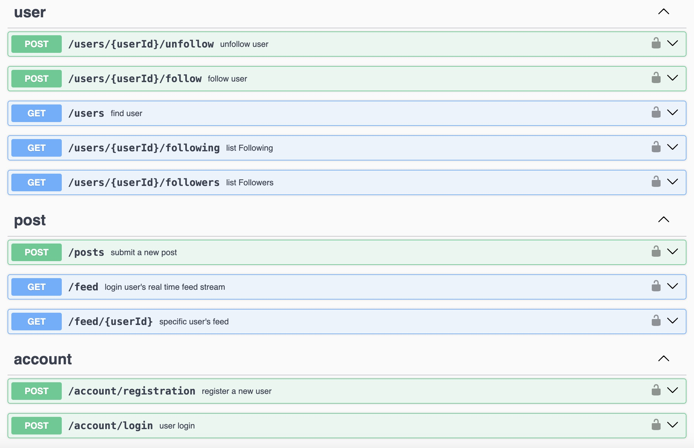

# Moikiitos System Design

## Architecture

 

## Api Design  

 

source file [./MoiKiitos-openapi.yml](./MoiKiitos-openapi.yml)

## Database Design

**user**
<pre>
    id  bigint  // PK
    name varchar(255)  // unique index
    email varchar(255) // unique index
    password varchar(255) // encrypted string
    create_at Timestamp
    update_at Timestamp
</pre>

**follower**
<pre>
    id         bigint    // PK
    follower_id bigint  // unique index  ux_follower_id_following_id
    following_id bigint // index  idx_following_id_follower_id
    create_at Timestamp
</pre>

**post**
<pre>
    id   bigint    // PK
    content varchar(2000)
    user_id  bigint // index
    create_at Timestamp
    update_at Timestamp
</pre>

